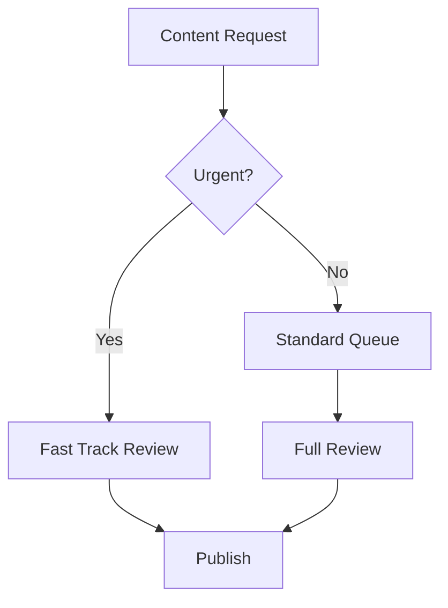

# Brand Docs Generator

> **Last Updated:** 2026-01-15  
> **Status:** ✅ Active  
> **Slug:** `brand-docs-generator`

## Overview

The Brand Docs Generator creates marketing documentation including brand voice guidelines, content playbooks, campaign briefs, team SOPs, and onboarding materials. It uses brand context (knowledge, KPIs, analytics) to generate grounded, brand-specific documentation.

## Key Features

- **6 Document Types**: Brand voice, playbook, campaign, SOP, social guidelines, onboarding
- **Brand Context Integration**: Uses knowledge base, KPIs, and analytics for grounding
- **Verbosity Control**: Concise, standard, or comprehensive output
- **Audience Targeting**: Marketing team, executives, clients, or new hires
- **Template Support**: Pre-configured document templates
- **Mermaid Diagrams**: Optional workflow/structure visualizations
- **Knowledge Base Export**: Save generated docs to brand knowledge base

## Scope

- **Type**: Brand
- **Required Role**: Content Creator or higher
- **Access**: Brand Page → AI Solutions → Brand Docs Generator

## Document Types

| Type | Sections | Use Case |
|------|----------|----------|
| `brand_voice` | Tone definition, vocabulary, dos/don'ts, examples, personas | Style consistency |
| `playbook` | Strategy overview, content pillars, channel guidelines, calendar, metrics | Content strategy |
| `campaign` | Objective, audience, messages, channels, timeline, budget, success metrics | Campaign planning |
| `sop` | Purpose, scope, workflow steps, tools, responsibilities, escalation, QA | Process documentation |
| `social_guidelines` | Platform overview, posting rules, engagement, hashtags, crisis response | Social media |
| `onboarding` | Welcome, service overview, expectations, communication, timeline, contacts, FAQ | Client onboarding |

## Data Sources

| Source | Table | Purpose |
|--------|-------|---------|
| Brand Info | `brands` | Name, description, website |
| Knowledge Files | `brand_knowledge_files` | File summaries for context |
| KPIs | `brand_kpis` | Brand goals and metrics |
| Analytics | `brand_analytics_data` | Performance data |
| Templates | `documentation_templates` | Pre-configured templates |
| Rules | `documentation_rules` | Formatting/content rules |

## Edge Function

**File**: `supabase/functions/documentation-generator-agent/index.ts`

### Request Schema

```typescript
interface BrandDocsRequest {
  topic: string;                   // Main topic to document
  additional_context?: string;     // Extra context or requirements
  template_id?: string;            // Optional template to use
  doc_type: 'brand_voice' | 'playbook' | 'campaign' | 'sop' | 'social_guidelines' | 'onboarding';
  output_format: 'markdown' | 'html';
  verbosity: 'concise' | 'standard' | 'comprehensive';
  target_audience: 'marketing_team' | 'executives' | 'clients' | 'new_hires';
  include_examples: boolean;
  include_diagrams: boolean;
  brand_id: string;
  save_to_knowledge_base?: boolean;
}
```

### Response Schema

```typescript
interface BrandDocsResponse {
  success: boolean;
  run_id: string;
  documentation: {
    title: string;
    overview: string;
    sections: DocumentationSection[];
    mermaid_diagram?: string;
    action_items?: string[];
  };
  formatted_output: string;  // Markdown or HTML
  meta: {
    response_time_ms: number;
    tokens_used: number;
    template_used: string | null;
    brand_name: string;
  };
  brand_context: {
    knowledge_items: number;
    has_kpis: boolean;
    has_analytics: boolean;
  };
}
```

## Output Format

### Documentation Section
```json
{
  "heading": "Tone Definition",
  "content": "PlatePresence brand voice is professional yet approachable...",
  "examples": [
    "✅ 'We help restaurants thrive'",
    "❌ 'We are the premier solution provider'"
  ]
}
```

### Mermaid Diagram


## Verbosity Levels

| Level | Description |
|-------|-------------|
| **Concise** | Brief and to the point. Only essential information. |
| **Standard** | Balanced documentation with moderate detail. |
| **Comprehensive** | Thorough with extensive explanations, examples, and edge cases. |

## Audience Instructions

| Audience | Approach |
|----------|----------|
| **Marketing Team** | Industry terminology, tactical details |
| **Executives** | Strategic implications, business impact, high-level |
| **Clients** | Professional, accessible, no internal jargon |
| **New Hires** | Thorough, explanatory, define terms |

## UI Components

- **Panel**: `src/components/agents/DocumentationGeneratorPanel.tsx`
- **Brand Selector**: Available when accessed from Admin AI Control
- **Context Preview**: Shows available knowledge, KPIs, analytics

### Brand Selector Flow

When accessed from Admin Panel (no brandId prop):
1. Brand selector dropdown appears
2. User selects a brand
3. Brand context is loaded and displayed
4. Generate button enables

When accessed from Brand Page (brandId prop provided):
- Skips brand selector
- Uses provided brand context

## AI Provider

- **Model**: gpt-4o
- **Temperature**: 0.4 (balanced creativity and consistency)
- **Response Format**: JSON object
- **Max Tokens**: 4096

## Best Practices

1. **Provide Topic**: Be specific about what aspect to document
2. **Additional Context**: Include any specific requirements or constraints
3. **Choose Right Audience**: Affects tone and depth of content
4. **Include Examples**: Makes documentation more actionable
5. **Save to Knowledge Base**: For important docs, save for future reference

## Configuration

```sql
SELECT * FROM ai_agents WHERE slug = 'brand-docs-generator';
```

Key config fields:
- `category`: `content_generation`
- `scope`: `brand`
- `data_sources`: `["brand_knowledge", "brand_analytics", "brand_kpis"]`

## Knowledge Base Integration

When `save_to_knowledge_base: true`:
1. Formatted output is saved as a markdown file
2. File is stored in brand's knowledge bucket
3. Record added to `brand_knowledge_files`
4. Available for future agent context

## Related Documentation

- [Brand Knowledge System](../../.agent/System/features/knowledge-base-system.md)
- [Documentation Templates](../../.agent/System/database_schema.md#documentation)
- [AI Agent System](../../.agent/System/ai_agent_system.md)
